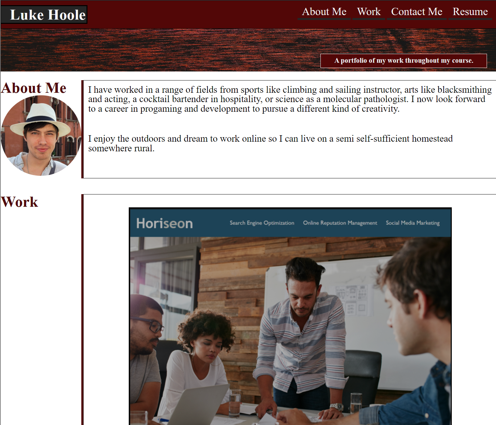

# <Luke Hoole, Work portfolio>

## Description

I have made a webpage from scratch to demonstrate what i have learned in the course so far as well as provide a hub to access all my work in future both through the course and otherwise.

## Installation

Not Required. 

## Usage

To see and overview of who I am, what work I have done and provide links to said work.
Access via: https://lhoole.github.io/Work-Portfolio/

## Credits
All images are created by me and my own work. The banner, a photo I took. The underconstruction, made in MS paint.

## License

See LICENSE

